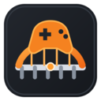

# TrainerBridge

<p align="center">
  
</p>

<p align="center">
  Launch standalone Windows trainers alongside Steam games running through Proton.
</p>

<p align="center">
  <a href="https://github.com/adventureFAN/TrainerBridge/releases/latest">Download the latest release</a>
  ·
  <a href="https://github.com/adventureFAN/TrainerBridge/issues">Report a bug</a>
  ·
  <a href="docs/TROUBLESHOOTING.md">Troubleshooting</a>
</p>

## 🎮 What TrainerBridge does

TrainerBridge scans your Steam libraries, detects each game's Proton version and compatdata prefix, and launches a standalone Windows trainer inside the matching Proton environment.

It does **not** include trainers, download trainers, modify game files, or bypass anti-cheat systems.

## ✨ Features

- Automatically scans Steam libraries and Proton prefixes.
- Imports and manages one trainer executable per Steam game.
- Launches the game and trainer together, or either one separately.
- Uses the exact Proton version and compatdata prefix selected for the game.
- Supports Steam installed as a native package, Snap, or Flatpak.
- Exports standalone launch scripts for configured games.
- Provides optional Prefix Components management through Protontricks.
- Creates safety backups before changing a Proton prefix.
- Supports copy-on-write folder backups on compatible Btrfs filesystems and compressed `.tar.zst` backups elsewhere.
- Restores or deletes backups with explicit safety warnings.
- Includes System, Light, and Dark themes, persistent window state, live logs, menus, shortcuts, and folder actions.

## 📦 Download and run

The recommended package is the AppImage from the [latest GitHub release](https://github.com/adventureFAN/TrainerBridge/releases/latest).

```bash
chmod +x TrainerBridge-<version>-x86_64.AppImage
./TrainerBridge-<version>-x86_64.AppImage
```

When FUSE is unavailable:

```bash
APPIMAGE_EXTRACT_AND_RUN=1 \
  ./TrainerBridge-<version>-x86_64.AppImage
```

A portable `.tar.xz` archive is also provided:

```bash
tar -xf TrainerBridge-<version>-x86_64.tar.xz
./TrainerBridge/TrainerBridge
```

Verify downloads with the matching `.sha256` file:

```bash
sha256sum -c TrainerBridge-<version>-x86_64.AppImage.sha256
```

## 🚀 Basic usage

1. Start every Proton game at least once through Steam so its compatdata prefix exists.
2. Open TrainerBridge and select **Rescan** when necessary.
3. Select a game and choose **Import Trainer**.
4. Use **Launch Game + Trainer**.
5. TrainerBridge waits for a verified Proton session, waits four additional seconds, and starts the trainer in the same prefix.

The imported trainer is copied to:

```text
~/.local/share/TrainerBridge/trainers/<AppID>/
```

Application data, logs, backups, and settings are stored below:

```text
~/.local/share/TrainerBridge/
```

## 🧩 Prefix Components

Prefix Components is an optional Protontricks frontend for installing common runtimes, fonts, settings, and applications into the selected game's prefix.

Requirements:

- Protontricks installed natively or as a Flatpak.
- The game must have a valid Proton prefix.
- The game must not be running while its prefix is modified.

TrainerBridge can create one safety backup per game. Existing backups can be replaced, kept while continuing without a new backup, restored, or deleted.

Component compatibility depends on the game, prefix state, Proton version, and Winetricks recipe. GE-Proton is recommended after an installation failure because it was the most reliable option during TrainerBridge testing, but it is not a guarantee.

## 🧱 Steam Flatpak

Steam Flatpak requires read-only access to TrainerBridge's trainer folder. TrainerBridge detects the missing permission and can grant it for you. Steam must be restarted after the permission changes.

TrainerBridge then finds the running game sandbox, reads the live Steam environment for the matching AppID, and launches the trainer inside that same session.

## ✅ Tested configurations

TrainerBridge 1.0 was manually tested during development on:

- Bazzite and Fedora Workstation
- Ubuntu
- Linux Mint
- CachyOS
- native Steam packages
- Steam Snap
- Steam Flatpak
- official Proton releases
- GE-Proton
- native and Flatpak Protontricks

Other Linux distributions and configurations may work, but cannot all be tested in advance.

## ⚠️ Safety and limitations

- Only use trainers from sources you trust.
- Do not use trainers in online or competitive multiplayer games.
- TrainerBridge does not bypass anti-cheat protections.
- Some trainers need additional Windows runtimes in the game's prefix.
- Prefix modifications can affect local save files, settings, registry data, DLL overrides, and installed runtimes.
- Deleting a prefix or its safety backup can cause irreversible data loss.
- A trainer that works under Windows is not guaranteed to work under Wine or Proton.

## 🐞 Reporting bugs

Use the [bug report template](https://github.com/adventureFAN/TrainerBridge/issues/new/choose) and include:

- TrainerBridge version
- distribution and desktop environment
- Steam package type
- Proton version
- Protontricks package type and version, when relevant
- game name and AppID
- filesystem and mount path of the Steam library
- reproduction steps
- relevant text copied from the in-app **Live Log** or saved manually with **Save as...**

Do not upload trainer executables, game files, personal data, or full prefixes.

## 🛠️ Building from source

Release builds use an Ubuntu 22.04 container to avoid inheriting a newer host glibc requirement.

```bash
./scripts/build_appimage.sh
```

See [Building TrainerBridge](docs/BUILDING.md) and [Testing TrainerBridge](docs/TESTING.md).

## 🤝 Contributing

Bug reports, documentation improvements, and tested fixes are welcome. Read [CONTRIBUTING.md](CONTRIBUTING.md) before opening a pull request.

## 👥 Credits

- Project direction, feature design, testing, and release decisions: **adventureFAN**
- Most implementation, debugging, and technical documentation: developed collaboratively with **ChatGPT by OpenAI**

TrainerBridge is not affiliated with Valve, Steam, CodeWeavers, Proton, Protontricks, Winetricks, or any trainer developer.

## 📄 License

TrainerBridge is released under the [MIT License](LICENSE). Third-party components retain their own licenses; see [Third-Party Notices](assets/THIRD_PARTY_NOTICES.txt).
